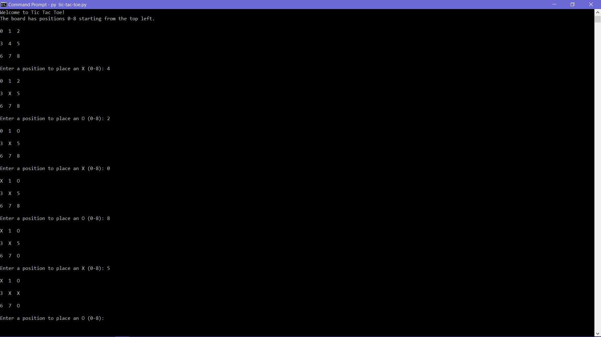

A simple text-based tic-tac-toe game written in python.

## Installation
clone the repository using
```
https://github.com/daspartho/tic-tac-toe.git
```

## Usage
Run the script from a terminal using
```
python tic-tac-toe.py
```

## Example


## Contributing
If you want to contribute code, just write a quick pull request and the developers will take a look at it.
If you want to suggest an idea, just write an issue and the developers will check it out!